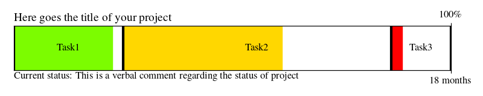

# progress_bar
A quick and dirty progress bar using matplotlib


## How to add your project's data
Write a `.json` file, say, `my_project.json`, and add your progress like this


```
{"Title":
    {"Task1":
        {"Subtask1":[time spent, time needed],
        "Subtask2":[..., ...]
        },
    ...
    },
"Current":"A verbal comment"
}
```

## Generating a progress bar

```
$ python progress_bar.py example.json
```


